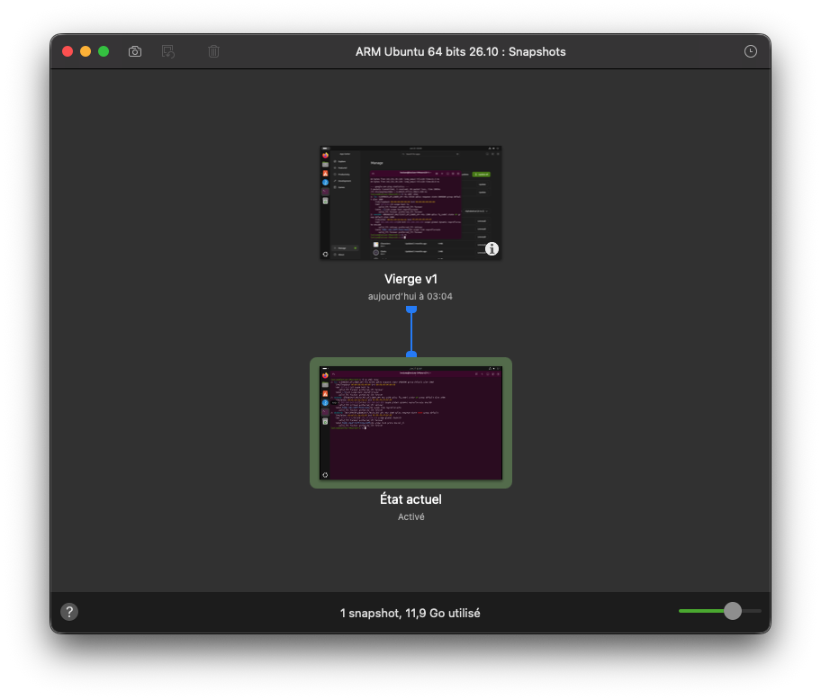

# TP2 — Pipeline CI/CD avec Jenkins

**Environnement** : VMware Fusion sur Mac M1 (Apple Silicon) — Ubuntu Server 26.04 ARM64

---

## 1. Installation de VMWare

- Télécharger et installer VMware Fusion Pro depuis le portail Broadcom
- Créer une machine virtuelle Ubuntu Server 24.04 ARM64

## 2. Configuration de la VM

- Vérifier l'accès à internet : `ping google.com`
- Vérifier l'adresse IP : `ip addr show`


- Réaliser un snapshot de la machine vierge



## 3. Installation de Docker Engine

```bash
sudo apt update
sudo apt install -y docker.io
sudo systemctl enable docker --now
sudo usermod -aG docker $USER
```

Vérification :

```bash
docker --version
docker run hello-world
```


## 4. Création du réseau Docker "devops"

```bash
docker network create devops
```

## 5. Déploiement de Jenkins

```bash
docker run -d \
  --name jenkins \
  --network devops \
  -p 8080:8080 \
  -p 50000:50000 \
  -v jenkins_home:/var/jenkins_home \
  jenkins/jenkins:lts
```

## 6. Finalisation de l'installation Jenkins

- Récupérer le mot de passe initial :
  ```bash
  docker exec jenkins cat /var/jenkins_home/secrets/initialAdminPassword
  ```
- Accéder à `http://192.168.243.129:8080`
- Suivre l'assistant d'installation (plugins suggérés)

## 7. Pipeline "Hello World"

- Créer un nouveau job Pipeline nommé `hello-world`
- Script :
  ```groovy
  pipeline {
      agent any
      stages {
          stage('Hello') {
              steps {
                  echo 'Hello World!'
              }
          }
      }
  }
  ```
- Lancer la pipeline

## 8. Pipeline CI/CD

- Créer un job Pipeline nommé `pipeline-cicd`
- Configurer **Pipeline script from SCM** :
  - SCM : Git
  - Repository URL : `https://github.com/LTOssian/efrei-pipeline.git`
  - Script Path : `tp2/Jenkinsfile`
- La pipeline contient 4 stages : Checkout → Build → Test → Deploy


## 9. Agent Jenkins

- **Manage Jenkins → Nodes → New Node**
- Nom : `agent-1`, Permanent Agent
- Remote root directory : `/home/louisan/jenkins-agent`
- Launch method : Launch agent via SSH
- Host : `192.168.243.129`


## 10. Tunnel ngrok

```bash
wget https://bin.equinox.io/c/bNyj1mQVY4c/ngrok-v3-stable-linux-arm64.tgz
tar xzf ngrok-v3-stable-linux-arm64.tgz
./ngrok config add-authtoken <TOKEN>
./ngrok http 8080
```


## 11. Webhook GitHub → Jenkins

- Dans GitHub : **Settings → Webhooks → Add webhook**
  - Payload URL : `https://<ngrok-url>/github-webhook/`
  - Content type : `application/json`
  - Events : Just the push event
- Dans Jenkins, sur le job `pipeline-cicd` : cocher **"GitHub hook trigger for GITScm polling"**


